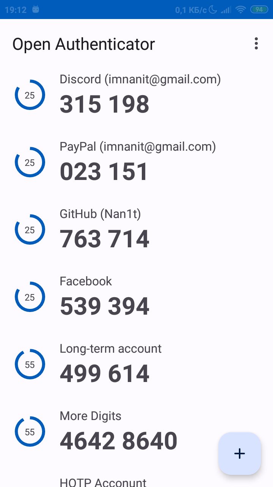
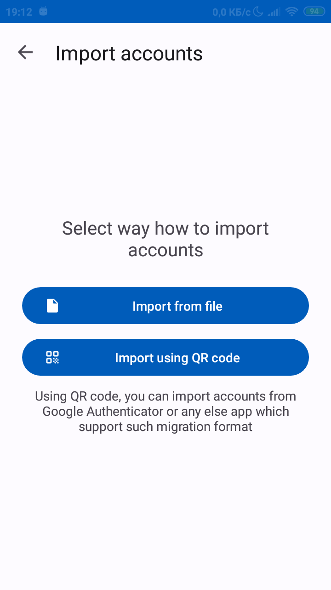
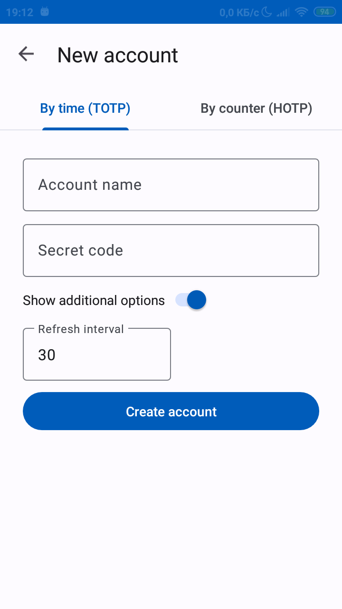
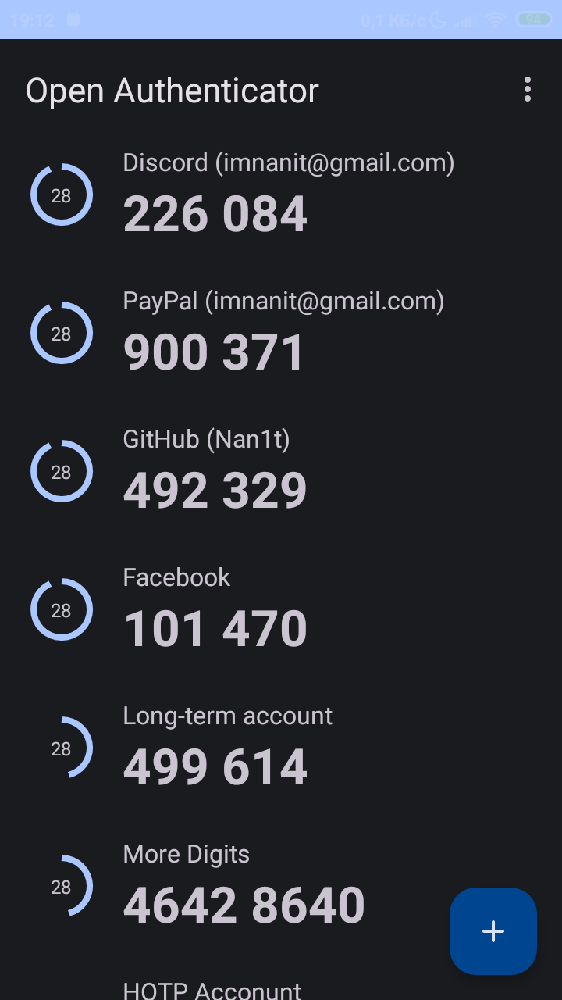
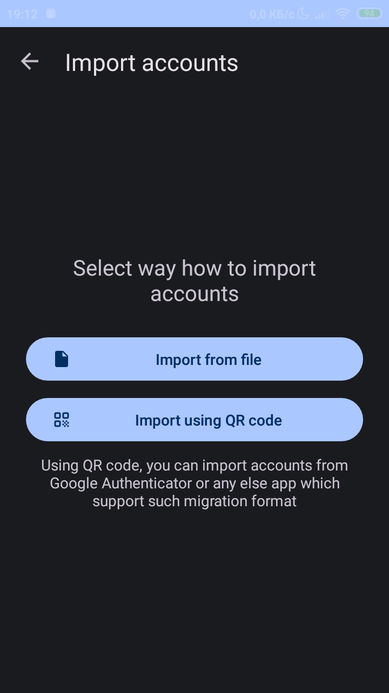
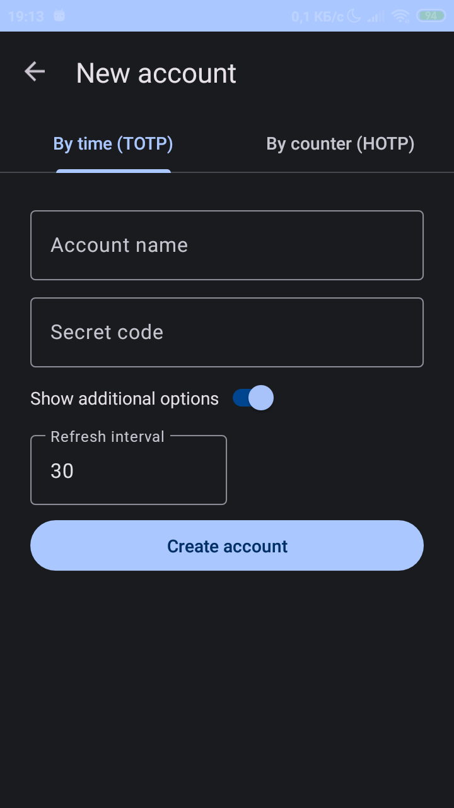

# OTP Manager

This is a simple and convenient OTP (One Time Password) manager for Android.

## Features

* Support both for TOTP and HOTP algorithms
* Export/Import accounts offline, through encrypted file or QR code
* Compatibility with Google Authenticator migration format
* Block access to codes using fingerprint, pin code or other available on device method.
* Built-in QR code scanner
* Multiple languages: English, Ukrainian, Russian
* Light/Night theme

## Requirements

* Android 5.0 +
* Camera (optional)

## Screenshots

|               1 (Light)               |               2 (Light)               |               3 (Light)               |
|:-------------------------------------:|:-------------------------------------:|:-------------------------------------:|
|  |  |  |

|               1 (Night)               |               2 (Night)               |               3 (Night)               |
|:-------------------------------------:|:-------------------------------------:|:-------------------------------------:|
|  |  |  |
